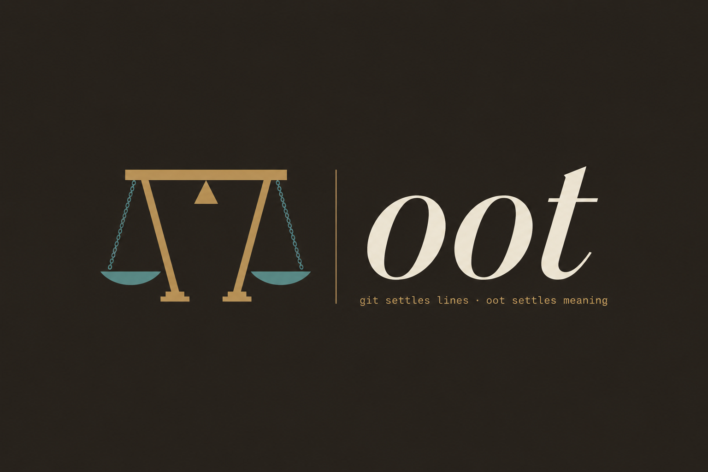

<p align="center"></p>

> Repos track lines. Oot governs changes: who may see them, what they mean, and when they may ship.

Oot is the court for code. It does not manage your commits or your branches. It adjudicates your **changes**: who is allowed to see a change, when it may become public, and what it means. A change can come from a human on git, an agent on Jujutsu, or a model running in memory. Oot judges all of them the same way. The project began as a five minute sketch about semantic merge conflicts. The real target is wider: governance over changes, with meaning as one axis among three.

## Why this exists

Agents now write a large share of our merges. A 2026 study of 142,652 AI-agent pull requests found that **27.67% hit merge conflicts**, and the bad ones touched around 500 lines across several files (AgenticFlict, [arXiv:2604.03551](https://arxiv.org/html/2604.03551)). When a conflict is about meaning rather than text, it ships bugs: a 2020 study of 143 open-source projects found code from semantic merge conflicts is **26 times more likely to be buggy** (Brindescu et al., [Empirical Software Engineering](https://stairs.ics.uci.edu/papers/2020/emperical_MC.pdf)). Anthropic's 2026 red-team study put three agents on one repo with conflicting goals; they slid into a turf war and produced code that merged cleanly but fought each other (Anthropic, [multiagent systems](https://www.anthropic.com/research/multiagent-systems)).

The deeper problem is that Git's primitives are the wrong shape for this world. Permissions are repository-level, so keeping one file private means a third-party secret manager and a prayer ([git-crypt](https://github.com/AGWA/git-crypt) exists, but it does encryption, not policy). Branches and pull requests add overhead that tools like [Jujutsu](https://github.com/jj-vcs/jj) have already shown we do not need. And a materialized working tree is a bottleneck: cloning or reinstalling thousands of small files takes 30 to 40 seconds on macOS APFS where Linux does it in 3 to 12.

Oot does not try to replace Git or Jujutsu. It sits above them and above the actor, and it answers the questions they were never built to answer.

## How Oot thinks: changes, not commits

Oot's unit is the **Change**, a content-addressed delta between two snapshots. No branch name, no commit message, no checkout required. From that one idea the rest follows.

- **Change**. A delta between two snapshots, from anywhere.
- **Visibility**. The governance spine. A policy on paths or branches: `private-to`, `embargo-until`, `public`. This is the `.env`, monorepo-privacy, and private-branch problem, handled as policy rather than cryptography.
- **Intent**. What the change claims to mean. Semantic disputes are checked against this. Meaning is one axis, not the whole product.
- **Dispute**. A point of disagreement. Either *visibility* (a policy is violated) or *meaning* (two changes diverge in intent).
- **Docket**. The adjudication record: disputes, verdict, visibility state, embargo date.
- **Verdict**. `adjudicated`, `blocked`, `embargoed`, or `cloaked`.

## How it works

A change arrives. Oot runs its checks and prints a docket.

```bash
$ oot adjudicate --change feature/auth-refactor

  OOT DOCKET
  ─────────────────────────────────────────
  change:     feature/auth-refactor
  from:       jj bookmark @ main
  base:       main@a3f7c1d
  head:       feature@b8e2f4a

  meaning:    4 disputes detected
  visibility:  1 private path, 1 embargoed until 2026-09-01
  scope:      auth flow, token refresh
  authors:    @kriday, @agent-7

  dispute-01: token refresh logic (line 42)       [meaning]
  dispute-02: error handling (line 87)            [meaning]
  dispute-03: return type mismatch (line 103)     [meaning]
  dispute-04: secrets/.env touched by @agent-7    [visibility]

  verdict:    ▶ ADJUDICATED. 1 requires review, 1 cloaked
  embargo:    patch held for maintainers until 2026-09-01

  [a]ccept · [r]eject · [d]ocket
```

If a dispute crosses policy, Oot blocks the change or cloaks the private parts. If the change is a security fix, Oot can hold it under embargo and distribute it quietly to maintainers before the diff goes public, the way the Git project and GitHub Security Advisories already do manually ([OSSF guide](https://github.com/ossf/oss-vulnerability-guide), [Git embargo process](https://www.kernel.org/pub/software/scm/git/docs/howto/coordinate-embargoed-releases.html)).

## Where Oot sits

- **Storage is someone else's job.** Oot reads snapshots from git or Jujutsu. It never owns the repository.
- **Execution is content-addressed.** The engine takes byte blobs and works on the parse tree. It never assumes a checked-out working tree, so it runs inside an agent's memory isolate and an agent in a worktree cannot hold `main` hostage.
- **Cryptography is delegated.** Actual encryption goes to git-crypt or a hosted key service. Oot owns the policy and the gate, not the math.

## Status

Working seed — the engine runs, the docket renders, and git + Jujutsu ingestion are in-memory. Current focus: using Oot to govern Oot's own changes.

- [x] Change ingestion from git snapshots (in-memory via `git ls-tree`/`cat-file`) and materialized dirs
- [x] Jujutsu ingestion (in-memory via `jj file list`/`file show`, revset resolution, first-class conflict detection)
- [x] Visibility policy: private paths, private branches, embargo schedules (the governance spine)
- [x] Meaning disputes from the structural engine (tree-sitter: Rust, Go, JavaScript)
- [x] Docket format with visibility and embargo state (JSON/TOML + render)
- [x] In-memory execution path (no materialized tree required for git)
- [x] Git adapter with 3-way adjudication
- [x] Jujutsu adapter with 3-way adjudication (`--source jj`, revsets accepted)

**Known limitation:** functions that share a bare name within one file (e.g., a `render` method on two classes, or same-named Go methods on two types) are tracked by first occurrence only; the docket flags them as ambiguous rather than tracking each definition separately.

## License

The adjudication runtime, the docket format, and the adapters are MIT licensed. A court that hides its deliberations is not a court, so the gate stays open.

## Someday

Deliberately unbuilt. These need users to be worth their cost, and there are none yet.

- **Hosted intent scoring** — a model that checks what a change claims to mean against what it actually does. The structural engine catches *that* code changed; this would catch *what it means*. Needs a server, a model, and someone paying for both.
- **Embargo distribution** — the courier half of embargo: quietly shipping held patches to maintainers before the public diff drops. Needs keyed private channels and maintainer auth. The detection half already ships.

## Try it

```bash
git clone https://github.com/Epoch-AI-Lab/oot.git
cd oot
cargo build --release
# materialized dirs
./target/release/oot adjudicate --change feature/auth-refactor --base fixtures/repo/base --head fixtures/repo/head --visibility fixtures/visibility.toml
# or 3-way git (in-memory, no checkout)
./target/release/oot adjudicate --change feature/auth-refactor --base-ref main --head-ref feature/auth --repo .
# or 3-way jujutsu (revsets welcome)
./target/release/oot adjudicate --source jj --change greet --base-ref 'bookmarks(exact:main)' --head-ref '@-'
```

## Contribute

We need people who have been burned by the primitives Oot sits above:

- **VCS adapter authors** who know git and Jujutsu internals and can turn snapshots into Changes.
- **Policy people** who have run embargoed releases and know where the process leaks.
- **Language experts** for the structural engine's semantic heuristics.
- **Anyone** who thinks a clean merge that ships a bug, or a public diff that burns a zero-day, is the worse failure.

See [CONTRIBUTING.md](./CONTRIBUTING.md).

---

*Repos track lines. Oot governs changes.*
